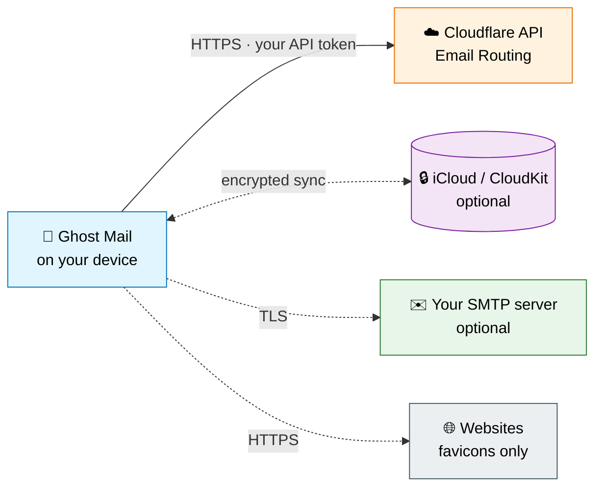

<div align="center">
  
#   Ghost Mail for iPhone and iPad

[](LICENSE)
[]()
[](https://github.com/sendmebits/ghostmail-ios/releases)
[](https://github.com/sendmebits/ghostmail-ios/issues)
[](https://github.com/sendmebits/ghostmail-ios/pulls)

[](https://apps.apple.com/app/ghost-mail/id6741405019)

</div>

Ghost Mail is a free and open-source iPhone and iPad app to manage email aliases for Cloudflare-hosted domains. It lets you quickly create disposable email addresses on the fly, shielding your main email from unwanted messages, data breaches, tracking and targeted ads. With full open-source transparency, you can enjoy peace of mind knowing that your primary email address is being kept private!

**Ghost Mail Features:**
- 📵 Easily ghost spammers by disabling or deleting aliases
- ✉️ Create private email aliases on the fly
- 🔒 Protects your main email from being exposed in breaches
- 🛠️ Verifiable 100% open-source software with no paywalls
- 📋 View all of your email aliases while offline
- 📨 Add multiple email domains and subdomains
- 💾 Sync to iCloud + CSV import/export
- 📧 Send email from email aliases (*SMTP required)
- 📨 Optional email analytics and charts (*Cloudflare API Analytics permission required)
- 🧭 Create aliases from Safari and other apps with the Share Extension
- ⚡ Quickly start a new alias with `ghostmail://create?url=...` deep links or the Home Screen "Create Alias" quick action

<p align="center">
  
  
  
</p>

## Table of Contents

- [Pre-requisites](#pre-requisites)
- [Getting Started](#getting-started)
- [CSV Import](#csv-import)
- [Privacy](#privacy)
  - [Data Flow](#data-flow)
  - [What Ghost Mail Doesn't Protect Against](#what-ghost-mail-doesnt-protect-against)
- [Building From Source](#building-from-source)
- [Why Use Email Aliases](#why-use-email-aliases)
- [Contributing](#contributing)
- [Security](#security)
- [License](#license)

# Pre-requisites

1. You must have a domain hosted by Cloudflare - https://cloudflare.com/
2. <code>Cloudflare.com > <domain.com> > Email > Email Routing</code> must be enabled
3. At least one verified destination email address must have been created:
       <code>Cloudflare.com > <domain.com> > Email > Email Routing > Destination Addresses</code> 

# Getting Started

Log in to your Cloudflare dashboard, choose a zone/domain, and copy Account ID and Zone ID from your domain's overview page.

You can enter credentials separately or use Quick Auth with the format:

```
Account ID:Zone ID:Token
```

**Quick Setup:** Use this [pre-configured API token link](https://dash.cloudflare.com/profile/api-tokens?permissionGroupKeys=%5B%7B%22key%22%3A%22analytics%22%2C%22type%22%3A%22read%22%7D%2C%7B%22key%22%3A%22dns%22%2C%22type%22%3A%22read%22%7D%2C%7B%22key%22%3A%22email_routing_address%22%2C%22type%22%3A%22read%22%7D%2C%7B%22key%22%3A%22email_routing_rule%22%2C%22type%22%3A%22edit%22%7D%2C%7B%22key%22%3A%22zone_settings%22%2C%22type%22%3A%22read%22%7D%5D&name=GhostMail&accountId=*&zoneId=all) to create a token with all required permissions pre-selected.

<details>
<summary><strong>Manual token setup &mdash; click to expand</strong></summary>

<br>

Go to Profile > <a href="https://dash.cloudflare.com/profile/api-tokens">API Tokens</a> > Create new token, then choose Custom token and grant the following permissions:

| Scope    | Resource                  | Access | Required?                                  |
| -------- | ------------------------- | ------ | ------------------------------------------ |
| Account  | Email Routing Addresses   | Read   | ✅ Required                                |
| Zone     | Email Routing Rules       | Edit   | ✅ Required                                |
| Zone     | Zone Settings             | Read   | ✅ Required                                |
| Zone     | Analytics                 | Read   | ⚪ Optional — needed for stats & charts    |
| Zone     | DNS                       | Read   | ⚪ Optional — needed only for subdomains   |

</details>

# CSV Import

Use the CSV import feature to quickly bulk add new email alias entries.

<details>
<summary><strong>CSV format and import behavior &mdash; click to expand</strong></summary>

<br>

CSV formatting is as follows:

```
Email Address,Website,Notes,Created,Enabled,Forward To,Action Type
user@domain.com,website.com,notes,2025-02-07T01:39:10Z,true,forwardto@domain.com,forward
```

| Column         | Type                   | Required? | Example                  | Notes                                         |
| -------------- | ---------------------- | --------- | ------------------------ | --------------------------------------------- |
| Email Address  | string                 | ✅        | `user@domain.com`        | Used to infer the target zone                 |
| Website        | string                 | ⚪        | `website.com`            | Optional metadata                             |
| Notes          | string                 | ⚪        | `signup for newsletter`  | Optional metadata                             |
| Created        | ISO 8601 timestamp     | ⚪        | `2025-02-07T01:39:10Z`   | Defaults to import time if omitted            |
| Enabled        | boolean (`true`/`false`) | ✅      | `true`                   | Whether the alias is active                   |
| Forward To     | string (email)         | ✅        | `forwardto@domain.com`   | A verified Cloudflare destination address     |
| Action Type    | string                 | ⚪        | `forward`                | Defaults to `forward` when omitted            |

**Import behavior:**
- On import, the app infers the target zone from the email domain in `Email Address`.
- Imports are limited to configured zones and enabled subdomains; unknown domains are skipped.
- If a domain is allowed but cannot be resolved to a specific zone, the current primary zone is used as a fallback.
- Imports will **update and overwrite** existing aliases; review after importing.

</details>

# Privacy

Ghost Mail is built so that your data stays between your device and the services you choose to use. There is no Ghost Mail-owned backend, no account to create, and **no telemetry, analytics, or crash reporting** &mdash; there is no server to send them to.

## Data Flow



*Solid arrows are required; dotted arrows are optional features. Notice there is no Ghost Mail server in this diagram &mdash; because there isn't one.*

**Storage and credential handling:**
- The app talks directly to Cloudflare using your API token with minimal required permissions.
- Your Cloudflare API token is stored securely in the iOS Keychain (with `kSecAttrAccessibleWhenUnlockedThisDeviceOnly`, so tokens never leave the device they were entered on, including via iCloud Keychain).
- SMTP credentials (if you configure sending email) are also stored securely in the iOS Keychain. SMTP traffic is encrypted by default (Implicit TLS or STARTTLS); plaintext is opt-in only and requires an explicit confirmation.
- Email aliases and their metadata (website, notes, dates) can optionally sync to your iCloud account for backup; you can turn this on or off in Settings at any time.
- Cached email statistics are written with `NSFileProtectionComplete`, so they are encrypted at rest while the device is locked. Favicon cache files also use complete file protection when available.
- Website logos (favicons) are fetched directly from each website only.

## What Ghost Mail Doesn't Protect Against

Open-source privacy tools work best when their limits are stated up front. Ghost Mail moves trust from a third-party alias provider to **you + Cloudflare**, but it does not change what Cloudflare and your other chosen services can see:

- **Cloudflare** sees every alias you create, the destination it forwards to, and the contents of forwarded mail as it transits Email Routing. Ghost Mail is a client for that service, not a replacement for it.
- **Your SMTP provider** (if you enable "Send from alias") sees every outgoing message and its recipients.
- **Apple / iCloud**, if you enable sync, stores your alias list under your iCloud account using CloudKit.
- **Aliases are not anonymity.** Reusing an alias across sites, or putting identifying information into a signup, can still correlate back to you. Treat aliases as compartmentalization, not anonymization.
- **A compromised device** is a compromised app. The iOS Keychain protects credentials at rest, but a device unlocked by an attacker can use your aliases the same way you can.

# Building From Source

Because Ghost Mail ships through the App Store, the binary Apple distributes is signed by Apple's chain and **cannot be bit-for-bit reproduced** from source by a third party. This is a limitation of every App Store app, not something specific to Ghost Mail. You can, however, independently verify what the app does:

1. Clone this repository.
2. Open `ghostmail.xcodeproj` in Xcode 16.2 or later.
3. Set your own development team under **Signing & Capabilities** for both the `ghostmail` and `GhostMailShareExtension` targets.
4. Build and run on your own device or in the simulator (iOS 18.2+).

The source in this repository is the source that ships &mdash; no closed components, no obfuscation, no bundled binaries. To independently verify the app's network behavior, run it behind a proxy such as [Charles](https://www.charlesproxy.com/) or [mitmproxy](https://mitmproxy.org/). The only endpoints Ghost Mail contacts are Cloudflare's API, optionally iCloud/CloudKit, your configured SMTP server, and websites for favicon fetches.

# Why Use Email Aliases

Email aliases protect your primary inbox from spam, phishing, and long-term exposure. Instead of handing out your real email, you give out an alias that can be turned off or deleted if abused. This helps maintain privacy and reduces the risk of account compromise.
- CISA guidance: <a href=https://www.cisa.gov/news-events/news/reducing-spam>Reducing Spam</a> – U.S. Cybersecurity & Infrastructure Security Agency warns against exposing your primary email address publicly.
- Expert opinion: <a href=https://krebsonsecurity.com/2022/08/the-security-pros-and-cons-of-using-email-aliases/>Brian Krebs on Email Aliases</a> – Security journalist Brian Krebs outlines the advantages and trade-offs of using aliases.

Aliases act as disposable shields for your identity, keeping your real account secure while still letting you receive messages when you want.

# Contributing

Issues and pull requests are welcome! A few notes to make collaboration smooth:

- For non-trivial changes, please open an [issue](https://github.com/sendmebits/ghostmail-ios/issues) first so we can align on scope before you spend time on code.
- Bug reports are most useful with iOS version, device, and reproduction steps.
- Feature requests are great &mdash; just be aware that anything requiring a server-side component is out of scope (see [Privacy](#privacy)).

# Security

If you believe you've found a security vulnerability, please **do not** open a public GitHub issue. Follow the responsible disclosure process described in [SECURITY.md](SECURITY.md).

# License

Ghost Mail is released under the [MIT License](LICENSE).
